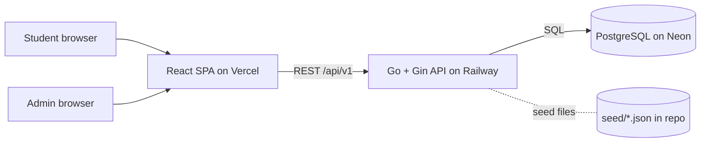
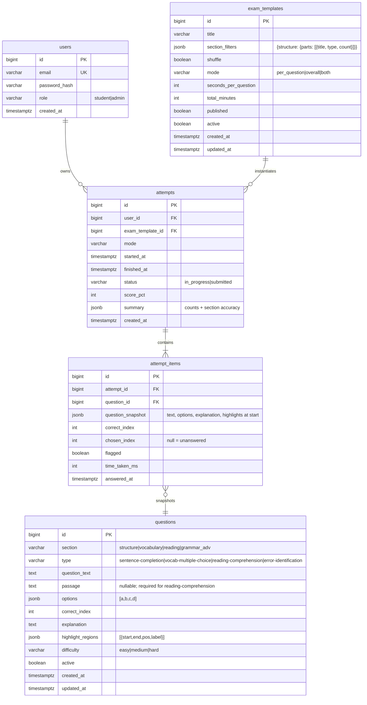

# TOEFL Prep — Software Requirements Specification (SRS)

**Status:** Draft v1.1 (updated 2026-08-24: 4 sections + passage + parts-based templates + endpoint drift sync)
**Date:** 2026-08-19
**Related docs:** [PRD.md](PRD.md) · [architecture.md](architecture.md) · [design.md](design.md) · [rules.md](rules.md)

---

## 1. Introduction

### 1.1 Purpose
This document specifies the functional and non-functional requirements for TOEFL Prep: a single-owner web app for practicing TOEFL-style questions under time pressure, reviewing answers with part-of-speech highlighted explanations, exporting attempts to PDF, and tracking score progress.

### 1.2 Scope
System covers: authentication (2 seeded accounts), question bank management (admin), exam templates, timed quiz taking (two modes), automatic scoring, attempt review with highlights, client-side PDF export, and a progress dashboard.

### 1.3 Conventions
- Requirements are tagged `FR-<n>` (functional) and `NFR-<n>` (non-functional).
- "MUST" / "SHALL" = mandatory; "SHOULD" = recommended; "MAY" = optional.
- Question refers to the bank entity; attempt refers to a student run of an exam.

---

## 2. Overall Description

### 2.1 System context



### 2.2 Users & roles
| Role | Capabilities |
|---|---|
| `student` | View published exams, take attempts, view reviews, export PDF, view own dashboard. |
| `admin` | Everything in `student` **plus** question CRUD, exam template CRUD + publish, re-seed bank. |

### 2.3 Assumptions & constraints
- Exactly two users; credentials seeded, not registered.
- Text-only questions (no audio, no images) in v1.
- Frontend and backend are separate deployments (Vercel + Railway).
- Clock skew: server timestamps are authoritative; client timers are display-only.
- Single timezone assumption is acceptable (personal tool); store UTC internally.

---

## 3. Functional Requirements

### 3.1 Authentication (FR-1)

- FR-1.1 POST `/auth/login` with email + password. On success, set an httpOnly, Secure, SameSite cookie containing a signed session token. On failure return `401`.
- FR-1.2 GET `/auth/me` returns the current user (id, email, role) or `401`.
- FR-1.3 POST `/auth/logout` invalidates the session and clears the cookie.
- FR-1.4 Passwords SHALL be hashed with bcrypt (cost ≥ 10).
- FR-1.5 All endpoints except `/auth/login`, `/auth/me` (unauth), health check, and seed-on-first-boot MUST require a valid session.
- FR-1.6 Role middleware MUST block `admin`-only endpoints for `student` sessions (`403`).
- FR-1.7 Sessions MUST expire (default 30 days, configurable) and be revocable.

### 3.2 Question bank (FR-2) — admin

- FR-2.1 Admin MAY create a question: section, type, question_text, optional passage, options (4), correct_index, explanation (in **Bahasa Indonesia**), difficulty, and optional highlight_regions.
- FR-2.2 Admin MAY edit any field of an existing question.
- FR-2.3 Admin MAY soft-delete (deactivate) a question. Deleted questions MUST NOT appear in new exams but MUST remain resolvable for historical attempts.
- FR-2.4 Admin MAY list/filter questions by section, type, difficulty, active status, and text search. Pagination required (default 20/page).
- FR-2.5 Validation: `question_text` non-empty ≤ 1000 chars; exactly 4 options, each non-empty ≤ 200 chars; `correct_index` in 0–3; `explanation` non-empty ≤ 2000 chars; highlight regions MUST fit within `question_text` bounds (non-overlapping with identical `pos` allowed; overlapping regions of different `pos` disallowed); `section` ∈ {structure, vocabulary, reading, grammar_adv}; `type` ∈ {sentence-completion, vocab-multiple-choice, reading-comprehension, error-identification}; each section has a default/inferred type (structure→sentence-completion, vocabulary→vocab-multiple-choice, reading→reading-comprehension, grammar_adv→error-identification); `reading-comprehension` items REQUIRE a non-empty `passage`; `passage` ≤ 4000 chars; Structure items require a blank (`_____`) in `question_text`.
- FR-2.6 Highlight region schema (JSONB): `{ "start": int, "end": int, "pos": string, "label": string? }`. `pos` ∈ {verb, noun, pronoun, adjective, adverb, preposition, conjunction, determiner, other}. `start < end`, `start ≥ 0`, `end ≤ len(question_text)`.
- FR-2.7 Seed command/endpoint MAY load `seed/*.json` and upsert questions idempotently (skip if identical by stable key).
- FR-2.8 **AI question import** (admin): POST `/questions/import` accepts pasted AI JSON output (produced **outside the app** per `prompts/question-generator.md`) — a single object or an array. The backend parses each item, validates per FR-2.5/FR-2.6, and normalizes AI-provided highlight phrases into offsets (see §6.5). Valid items are returned as draft previews for the admin to review and save; invalid items are returned with per-item reasons and do not block valid ones. Nothing is stored until the admin explicitly saves a draft. The import endpoint is admin-only and does not call any LLM.

### 3.3 Exam templates (FR-3) — admin

- FR-3.1 Admin MAY create an exam template: `title`, `section_filters` (**parts-based**: `{section: {parts: [{title, type, count}]}}`, e.g. `{"structure": {"parts": [{"title": "Part 1", "type": "sentence-completion", "count": 8}]}}`), `shuffle` (default true), `mode` ∈ `per_question` | `overall` | `both`, `seconds_per_question` (per-question mode, default 60), `total_minutes` (overall mode, default 15), `published` (default false).
- FR-3.2 Admin MAY edit, duplicate, delete (soft), publish/unpublish templates.
- FR-3.3 Only `published` templates are visible/startable by the student. The student-facing exam list and the admin list are served by the same role-aware `GET /exams` endpoint.
- FR-3.4 Template validation: at least one section; every part MUST have a valid section/type pairing and `count ≥ 1`; bank MUST contain enough active questions per part's section+type to satisfy the template; if `mode = overall`, `total_minutes ≥ 1`; if `mode = per_question`, `seconds_per_question ≥ 10`.
- FR-3.5 The student SHALL be able to pick per-question or overall mode when the template `mode = both`.

### 3.4 Quiz taking (FR-4)

- FR-4.1 POST `/attempts` with exam template id (+ optional chosen mode) creates an attempt: snapshots selected questions (per section_filters, shuffled) into attempt items, records `started_at`.
- FR-4.2 GET `/attempts/:id/questions` returns the attempt questions **without** correct answers or explanations (one per item).
- FR-4.3 PUT `/attempts/:id/answers/:item_id` records the selected option (index or null) per question item. Client MAY send answers incrementally; server upserts.
- FR-4.3a PUT `/attempts/:id/flag/:item_id` toggles the `flagged` marker on an attempt item (used by the overall-mode palette).
- FR-4.4 POST `/attempts/:id/submit` finalizes the attempt, computes the report server-side, sets `finished_at`, and returns the result summary. Idempotent: submitting twice returns the same report.
- FR-4.5 **Per-question mode:** selecting an option immediately advances (client behavior); a per-question timeout (client) marks that item answered as null and advances. The server does NOT auto-advance; the client drives it, the server stores the final snapshot at submit.
- FR-4.6 **Overall mode:** student MAY jump between questions, flag items, and see answered/unanswered. Client enforces a confirmation dialog before submit.
- FR-4.7 On submit, any unanswered items are recorded as unanswered (not wrong-scored, but excluded from correct count).
- FR-4.8 An attempt in progress MAY be abandoned; an abandoned attempt is not scored and MAY be resumed within the session only (no cross-session resume in v1).
- FR-4.9 Timer source of truth: the server uses `started_at` and the **overall mode's** time limit to refuse `submit` after the deadline has passed — the server SHALL cap `finished_at` at the deadline and mark unanswered anything past it. In **per-question mode there is no global deadline**: the per-question clock is client-driven for UX, the client auto-advances on timeout, and the server simply stores what is submitted. The client timer is display-only in both modes.
- FR-4.10 A student MAY NOT start a new attempt of the same exam template while an unfinished attempt of it exists (one active attempt per template).

### 3.5 Scoring (FR-5)

- FR-5.1 Overall score = `round(100 * correct / total)` (percentage, integer).
- FR-5.2 Per-section accuracy: `correct_in_section / total_in_section` per `section`.
- FR-5.3 Counts: `correct`, `wrong`, `unanswered`.
- FR-5.4 Report SHALL be computed by a pure function `Grade(inputs) -> Report` (see architecture.md) so it is fully unit-testable; it MUST be deterministic given the same attempt snapshot.

### 3.6 Review (FR-6)

- FR-6.1 GET `/attempts/:id/review` returns full review data for a finished attempt: per item — question text, options, correct_index, chosen_index, is_correct, is_unanswered, explanation (**in Bahasa Indonesia**), highlight_regions, section, type, and (when configured) per-item time spent.
- FR-6.2 The review UI MUST render highlight regions on `question_text` as colored spans, color-coded by `pos`, each span carrying a visible label/legend (not color alone) for accessibility.
- FR-6.3 The student SHALL be able to open the review from the result screen, the dashboard, and the attempts list.
- FR-6.4 Review is read-only.

### 3.7 PDF export (FR-7)

- FR-7.1 The review page MUST expose an "Export PDF" action producing a print-optimized layout (hide nav, expand all items, page margins, header with exam title + date + score) and triggering the browser print dialog so the user can "Save as PDF".
- FR-7.2 The print layout MUST include: header, summary block (score, counts, per-section), and every question with your answer vs correct answer, explanation, and highlight rendering.
- FR-7.3 `@media print` MUST hide non-print UI (buttons, nav, interactive states) and force full-color-safe rendering (assume `color-adjust: exact`).
- FR-7.4 Optional: a SHALL-level alternative via `react-pdf` to produce a downloadable file when a real file download is desired (parked; not required for MVP acceptance).

### 3.8 Dashboard (FR-8)

- FR-8.1 GET `/dashboard/stats` returns: `total_attempts`, `average_score`, `best_score`, `trend` (delta vs previous window), score series `[{attempt_id, score, date, section_scores}]`, per-section averages, and worst POS category.
- FR-8.2 Frontend renders a line/area chart of score vs date with a trend line, a bar chart per section accuracy, stat cards, and a recent-attempts list linking to reviews.
- FR-8.3 Metrics MUST be computed from attempts the student owns; admin sees the same single student's data (same owner).
- FR-8.4 Empty state: with zero attempts, dashboard shows guidance instead of charts.

---

## 4. Non-Functional Requirements

- NFR-1 (Performance): First meaningful paint ≤ 2s on 4G; quiz screen must render an answered/unanswered state transition within 100 ms of interaction; dashboard chart loads within 1s of data fetch.
- NFR-2 (Accessibility): WCAG 2.1 AA. Text contrast ≥ 4.5:1; focus visible; full keyboard navigation (question options reachable and selectable via keyboard A–D); `prefers-reduced-motion` respected; touch targets ≥ 44×44 px.
- NFR-3 (Security): bcrypt password hashing; httpOnly + Secure + SameSite cookies; CSRF protection for mutating requests; server-side validation on all inputs; role checks server-side (never rely on client); no secrets in client bundle; rate-limit login (e.g. 10/min/IP); the import endpoint is admin-only; AI is generated outside the app, so no LLM API key ever lives in the system.
- NFR-4 (Reliability): submit idempotent; DB transactions wrap attempt creation + item inserts; migrations applied before deploy (goose); graceful JSON errors with stable error codes.
- NFR-5 (Maintainability): grading/reporting logic pure and unit-tested; API follows the response envelope (see rules.md); typed frontend (TypeScript strict); seed fixtures double as tests.
- NFR-6 (Performance of exports): PDF print layout must not re-fetch data (print from in-memory review data) and must not require the network to render.
- NFR-7 (Portability): Responsive from 375 px to 1440+ px; no horizontal scroll; works on Chrome, Firefox, Safari, Edge (latest two versions).

---

## 5. Data Model



Notes:
- `attempt_items.question_snapshot` makes the attempt immutable to later bank edits (D6).
- `highlight_regions` and `section_filters` are JSONB — the data is write-once-per-edit, read often, and validated server-side.
- Indexes: `attempts(user_id, started_at)`, `attempt_items(attempt_id)`, `questions(section, active)`, `questions(type)`.

---

## 6. Highlight System Specification

### 6.1 Purpose
During review, the tested concept (e.g. a verb, a pronoun) is visually highlighted **inside the question text** so the explanation is anchored to the exact words it discusses.

### 6.2 Storage
On each question, `highlight_regions` is a JSON array (validated per FR-2.6):

```json
{
  "start": 21,
  "end": 26,
  "pos": "verb",
  "label": "Verb"
}
```

### 6.3 Rendering rules
- Regions are computed in character offsets on `question_text` (UTF-8-safe: compute offsets on the **visible string**, not bytes — frontend MUST use JS string indices; backend validation MUST use Go `rune` counts).
- Adjacent regions of the same `pos` merge visually.
- Overlapping regions with different `pos` are rejected at write time (FR-2.6).
- Each `pos` maps to a distinct color + a distinct underline style in the design system (`design.md §3`); a legend MUST be visible on the review screen.
- Region spans are non-interactive during review (read-only) but MUST have `title`/`aria-label` describing the `pos`.

### 6.4 Admin editor behavior
- The admin selects a range of text in the question editor; a popover offers the POS categories; on save, a region is created.
- Regions render live as colored spans under the textarea for immediate feedback.
- The admin MAY delete a region.

### 6.5 AI-driven highlight normalization
AI output imported via FR-2.8 provides highlights as **POS → phrases** (verbatim substrings), not offsets, because LLMs produce reliable words but unreliable indices. The backend:
1. Locates each phrase case-insensitively at word boundaries in `question_text`.
2. Converts first match to `{start, end}` using Go `[]rune` offsets (UTF-8-safe).
3. Skips phrases not found (log warning) — does not fail the item.
4. Direct offset input (`highlight_regions`) is validated per FR-2.6 (bounds, overlap) and rejected on violation.
5. Result is stored in `questions.highlight_regions`; phrases are discarded.

---

## 7. Scoring Specification

```
correct   = # of items where chosen_index == correct_index
wrong     = # of items where chosen_index != null AND chosen_index != correct_index
unanswered= # of items where chosen_index == null
score_pct = round(100 * correct / (correct + wrong + unanswered))   // denominator = total items
```

- Per-section: `correct_section / items_section` as percentage.
- Determinism: given identical attempt snapshot + answers, the same report MUST result. Implemented as a pure function in the grading module.
- Edge cases: zero questions → invalid (rejected at template validation); all unanswered → 0%.

---

## 8. API Specification

Base: `/api/v1`. Envelope (see rules.md §6):

```json
{ "data": <payload> }          // success
{ "error": { "code": "..", "message": ".." } }   // failure
```

| Method | Path | Role | Purpose |
|---|---|---|---|
| POST | `/auth/login` | public | Login, sets session cookie |
| POST | `/auth/logout` | any | Clear session |
| GET | `/auth/me` | any | Current user |
| GET | `/questions` | admin | List/filter bank (paged) |
| POST | `/questions` | admin | Create question |
| GET | `/questions/:id` | admin | Read question |
| PUT | `/questions/:id` | admin | Update question |
| DELETE | `/questions/:id` | admin | Soft-delete |
| POST | `/questions/seed` → implemented as `POST /seed` | admin | Load seed files (idempotent upsert) |
| POST | `/questions/import` | admin | Validate + import pasted AI JSON (drafts) |
| GET | `/exams` | any (role-aware) | List templates — students see published only; admins see all |
| POST | `/exams` | admin | Create template |
| PUT | `/exams/:id` | admin | Update template |
| DELETE | `/exams/:id` | admin | Soft-delete template |
| POST | `/exams/:id/publish` | admin | Toggle publish |
| POST | `/attempts` | student | Start attempt (template + mode) |
| GET | `/attempts/:id/questions` | student | Attempt questions (no answers) |
| PUT | `/attempts/:id/answers/:item_id` | student | Record answer |
| PUT | `/attempts/:id/flag/:item_id` | student | Toggle flag on attempt item |
| POST | `/attempts/:id/submit` | student | Finalize + grade |
| GET | `/attempts/:id/review` | student | Full review data |
| GET | `/attempts` | student | Own attempt list |
| GET | `/dashboard/stats` | student | Aggregated progress |

Error codes: `auth_required`, `forbidden`, `not_found`, `validation_failed`, `conflict`, `rate_limited`, `internal`.

---

## 9. Non-functional acceptance checks (summary)

- [ ] Lighthouse accessibility ≥ 95 on login, dashboard, quiz, review.
- [ ] Login rate-limited; bcrypt cost ≥ 10.
- [ ] Grade() has ≥ 90% coverage with fixture-based tests.
- [ ] Print layout renders without network fetch.
- [ ] Dashboard loads with 0 attempts (empty state) and 100 attempts (chart legible).
- [ ] Cross-browser smoke: Chrome, Firefox, Safari, Edge.
