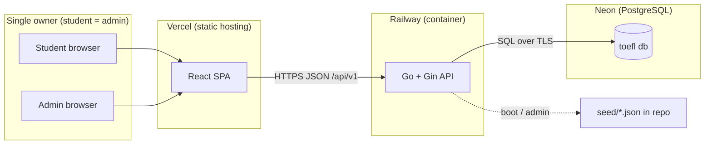
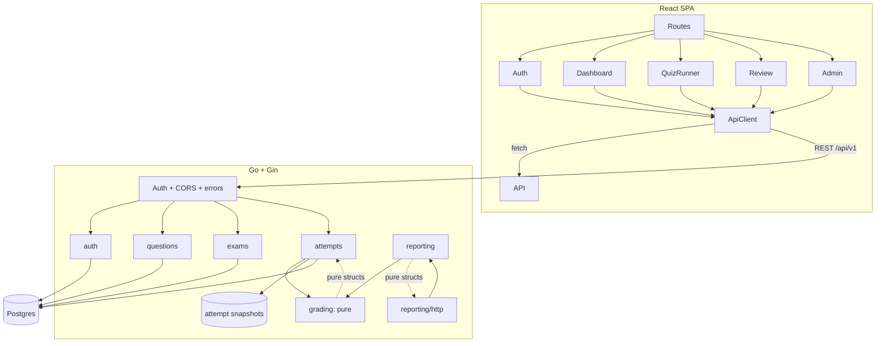
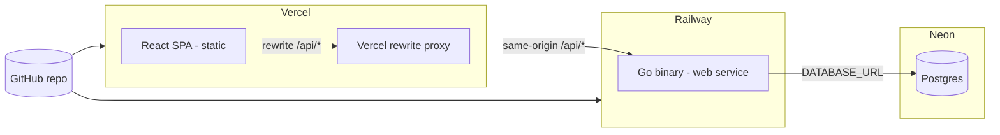

# TOEFL Prep — Architecture

**Status:** Draft v1.0
**Date:** 2026-08-19
**Related docs:** [PRD.md](PRD.md) · [SRS.md](SRS.md) · [rules.md](rules.md) · [design.md](design.md)

---

## 1. Architectural goals

1. **The grading engine is the deepest module.** All scoring, review assembly, and dashboard math flows through pure functions with no I/O. If the business logic is trivially testable, the rest is plumbing.
2. **Attempts are immutable.** Once started, an attempt owns a snapshot of its questions; bank edits never change history.
3. **Frontend owns UX, backend owns truth.** Timers are displayed by the client, enforced by the server.
4. **Keep the surface small.** Two roles, one owner, one backend process, one Postgres. No microservices, no queues, no cache layers — they'd only add failure modes for zero benefit here.

---

## 2. Context diagram



- Frontend is a static SPA (no SSR) — a perfect fit for Vercel; the API is a single Go binary on Railway; data lives in Neon Postgres.
- AI question drafting happens **outside the system** (Claude/Gemini/ChatGPT in the owner's chat tool) and enters through the admin import endpoint. No LLM API key or external provider call exists in the deployment.
- `CORS_ORIGINS` (Railway env) is the only origin allowed to call the API.

---

## 3. Container / module decomposition



### Backend modules (one package per concern)

| Module | Responsibility | I/O |
|---|---|---|
| `internal/config` | Load + validate env at boot | env |
| `internal/database` | pgx pool, goose runner | DB |
| `internal/http` | Router assembly, middleware (auth, CORS, recovery, error mapping) | HTTP |
| `internal/auth` | Session issue/verify, bcrypt verify, `me` | DB + cookie |
| `internal/questions` | Bank repo + service, validation, seed loader, **import pipeline** (parse pasted AI JSON, validate per FR-2.5/2.6, normalize highlight phrases → offsets) | DB |
| `internal/exams` | Exam template repo + service + publish | DB |
| `internal/attempts` | Start (snapshot), answer, submit, review queries | DB |
| `internal/grading` | **Pure**: `GradeAttempt`, `BuildReport`, section splits | none |
| `internal/reporting` | Dashboard aggregates (uses grading on stored summaries) | DB |
| `internal/seed` | Load `backend/seed/*.json` into questions | DB + files |

---

## 4. The deep module: grading engine

`internal/grading` is designed as the classic **deep module** — a wide contract, a tiny surface:

```
type Input struct {
    Items []GradedItem  // snapshot text/options/correct + chosen + timing
    Section map[itemID]string
}
type Report struct {
    ScorePct   int
    Correct    int
    Wrong      int
    Unanswered int
    Sections   []SectionReport
    Items      []ItemReport      // used by review UI
    WorstPOS   string
}
func Grade(in Input) Report
```

- **No DB, no HTTP, no logging, no time.** It cannot fail; it cannot be called incorrectly in a way that touches the outside world.
- Everything the review and dashboard show is derived here: per-item `is_correct`, per-section accuracy, worst POS category (from highlight regions of wrong answers).
- Because it is pure, the test suite feeds it the exact structs produced by a real attempt (from seed fixtures) and asserts exact reports — the highest-value tests in the repo.

**Why this shape:** the whole product's trust lives in "did the score match my answers?" If grading is trivial to test and impossible to corrupt with I/O, that trust is cheap to maintain.

---

## 5. Data flows

### 5.1 Start an attempt

```mermaid
sequenceDiagram
    participant FE as React SPA
    participant API as Gin API
    participant DB as Postgres
    FE->>API: POST /attempts {exam_id, mode}
    API->>DB: SELECT exam + active questions (shuffled)
    API->>DB: BEGIN; INSERT attempt; INSERT attempt_items (snapshot); COMMIT
    API-->>FE: 201 {attempt_id, mode, deadline}
```

- The snapshot copies `question_text`, `options`, `correct_index`, `explanation`, `highlight_regions` into `attempt_items` at start time — history is frozen here (D6).
- One active attempt per template (FR-4.10).

### 5.2 Answer + submit

```mermaid
sequenceDiagram
    participant FE as React SPA
    participant API as Gin API
    participant G as grading (pure)
    participant DB as Postgres
    loop answering (per-question mode: auto-advance)
        FE->>API: PUT /attempts/:id/answers/:item {chosen}
        API->>DB: upsert attempt_items.chosen_index
    end
    FE->>API: POST /attempts/:id/submit
    API->>DB: lock attempt; check deadline
    API->>DB: read all items
    API->>G: Grade(items)
    API->>DB: UPDATE attempt (status, score, summary); COMMIT
    API-->>FE: 200 {report summary}
```

- Submit is idempotent (FR-4.4): a second submit returns the stored report.
- If the server clock says the deadline passed, the server marks past-deadline items as unanswered and finalizes (FR-4.9).

### 5.3 Review + PDF

- `GET /attempts/:id/review` rebuilds item reports via `grading.Grade` over the stored snapshot + answers (or reads the stored summary for the header).
- The frontend holds the full review payload in memory; "Export PDF" switches to the print layout and calls `window.print()` — **no extra network call** (NFR-6).

### 5.4 Dashboard

- `GET /dashboard/stats` reads the student's attempts, derives the score series, per-section averages, and worst POS from `grading` + stored `summary`, and returns a single aggregated payload. Charts render client-side with Recharts.

### 5.5 AI question import (drafts made outside the app)

```mermaid
sequenceDiagram
    participant Owner as Admin (owner)
    participant Chat as Claude / Gemini / ChatGPT
    participant API as Gin API
    participant DB as Postgres
    Owner->>Chat: runs prompt from prompts/question-generator.md
    Chat-->>Owner: JSON draft(s)
    Owner->>API: POST /questions/import {json}
    API->>API: parse; validate per FR-2.5/2.6; normalize highlight phrases → offsets
    API-->>Owner: 200 drafts + per-item status (or validation_failed)
    Owner->>Owner: reviews/edits drafts in the editor
    Owner->>API: POST /questions (save) → stored in bank
```

- The prompt contract lives at `prompts/question-generator.md` and is used **by the owner in their chat tool** — the app never calls an LLM. `internal/questions` owns the import + validation + normalization pipeline.

---

## 6. Authentication & security

- **Sessions, not JWTs.** Login verifies bcrypt against `users`, then issues a signed httpOnly cookie (`SESSION_SECRET`-signed, 30-day expiry). Middleware resolves `user_id` + `role` per request.
- **CSRF:** SameSite cookies + a CSRF token header checked on mutating requests.
- **RBAC:** `RequireRole("admin")` middleware on question/exam/seed routes. Role checks are server-side only.
- **Seeded accounts:** `student@…` and `admin@…` created by the first migration/seed run with documented passwords in the dev README (owner-only tool). Passwords changed via `go run cmd/passhash` + update, or a tiny admin endpoint (parked).
- **Rate limiting:** login endpoint throttled (10/min/IP).
- **Validation:** all JSON parsed with unknown-field rejection; highlight regions validated as rune offsets server-side.

---

## 7. Deployment



- **Vercel:** builds `frontend/`, serves static assets, env `VITE_API_URL=/api` (relative). A **rewrite rule proxies `/api/*` → `<railway-domain>/api/*`**. This makes API calls **same-origin**, so httpOnly SameSite cookies work without `SameSite=None` (which would weaken security and require `Secure` on a non-secure context). No `CORS_ORIGINS` gymnastics needed for cookies — CORS is still configured for direct calls as a fallback.
- **Railway:** builds `backend/` (Dockerfile or buildpack), runs `goose up` via a start command/migration step, then `./api`. Env: `DATABASE_URL`, `SESSION_SECRET`, `PORT`, `CORS_ORIGINS`.
- **Neon:** branch-based Postgres; connection string is a secret; pool via pgx with sane max connections (Neon free tier is conservative).
- **Seed:** run once via admin endpoint `POST /questions/seed` or a boot flag; idempotent by stable question key.
- **CORS:** API replies `Access-Control-Allow-Origin: <Vercel origin>` and reflects the allowed methods/headers; preflight handled by middleware. With the rewrite proxy in place, cookies flow same-origin and the client sends a CSRF token header on mutating calls.

---

## 8. Architecture Decision Records (mini-ADRs)

| ID | Decision | Status | Rationale |
|---|---|---|---|
| ADR-01 | Postgres (Neon) for question bank + attempts, seeded from committed JSON | **Accepted** | Admin edits need a DB; highlights are structured; seed files give instant working bank + test fixtures (D1). |
| ADR-02 | Attempts snapshot questions at start | **Accepted** | History integrity; bank edits never corrupt finished exams (D6). |
| ADR-03 | Grading is a pure module | **Accepted** | Highest-leverage testability; product trust lives here. |
| ADR-04 | Client-side PDF via print stylesheet | **Accepted** | No file storage, no backend dep, Vercel-friendly; falls back to react-pdf if a real download is wanted (D4). |
| ADR-05 | Sessions (httpOnly cookie) instead of JWT/refresh | **Accepted** | Two users; simplicity; revocable; CSRF handled with SameSite + token. |
| ADR-06 | Server time is authoritative for deadlines | **Accepted** | Client timers can drift; server caps `finished_at` and marks late items unanswered. |
| ADR-07 | Monolith Go service; no queue/cache/microservices | **Accepted** | Single owner, single region; added infra would be pure overhead (NFR-5). |
| ADR-08 | `questions.highlight_regions` as JSONB | **Accepted** | Write-per-edit, read-heavy, validated server-side; avoids join tables for a single-owner tool. |
| ADR-09 | One active attempt per exam template | **Accepted** | Avoids unbounded open attempts; keeps the "progress" signal clean. |
| ADR-10 | AI drafts questions **outside the app** (prompt contract in `prompts/question-generator.md`); the app only imports + validates the pasted output | **Accepted** | No LLM call or API key inside the system; the owner uses their own chat tool; the app keeps one clean, well-defined import surface (D8). |
| ADR-11 | Vercel rewrite proxy `/api/*` → Railway; httpOnly SameSite=Lax cookies over same-origin | **Accepted** | Cross-site cookies are silently dropped by browsers; the proxy avoids `SameSite=None` and keeps auth simple and secure. |

### ADR review policy
If a future change needs to reverse an ADR, update this table with a `Superseded` status and link the new ADR. Do not silently violate an ADR — record it.

---

## 9. Cross-cutting concerns

- **Observability:** minimal — structured logs (request id, method, path, status, duration), request logging middleware, panic recovery returning the envelope's `internal` error. No metrics infra in v1.
- **Graceful shutdown:** SIGTERM → stop accepting, drain connections, close pool.
- **Timezone:** store UTC; client renders local.
- **Testing pyramid:** pure grading unit tests (widest) → service tests with test DB → thin handler tests → one contract-level smoke test per flow.